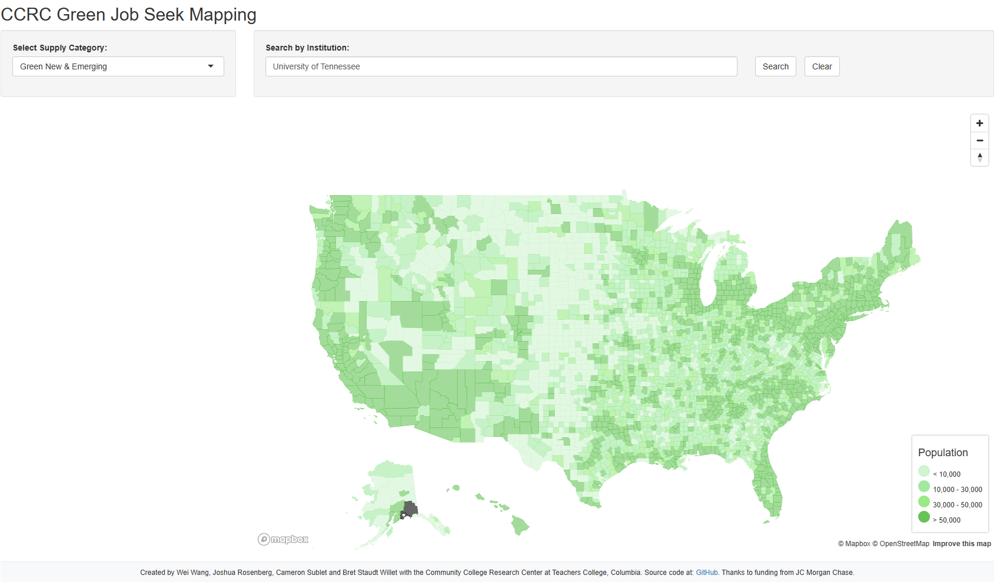

README
================

## Overview

docs for Mapbox GL JS : <https://docs.mapbox.com/mapbox-gl-js/api/>

This app built for Hover function for demand side, we will use the US
county population to have a try!

## Data used for the app

data needed to run locally: \* `ipeds_green_summed.rds` \*
`hdallyears.rds` \* \`counties_sf.rds

## Raw data used to create the data used for the app

`pre-county-population.R` is used to create fake “demand” side data,
which is US county level population data from tidycensus package.

data folder, private:
<https://liveutk-my.sharepoint.com/personal/csublet1_utk_edu/_layouts/15/onedrive.aspx?e=5%3A0b3e911b6a2f48f28fe9b3e7d0c53f70&sharingv2=true&fromShare=true&at=9&CID=882de04e%2D35af%2D4440%2Dad6e%2Db77fea949e96&id=%2Fpersonal%2Fcsublet1%5Futk%5Fedu%2FDocuments%2FResearch%2FGreenJobs&FolderCTID=0x01200008BE93ABE0F3EF43905625E5D5D49057&view=0>

## Wei update the app on Jan 26th.

we still use shiny, but drop off the mapboxer package, use JS for both
supply and demand. We just finish HOver for demand side, I will try to
update the supply side once Cameron determine the requirements.

To run this app locally, set up the map token, like ”
Sys.getenv(“MAPBOX_TOKEN”)”

The hover UI: 
